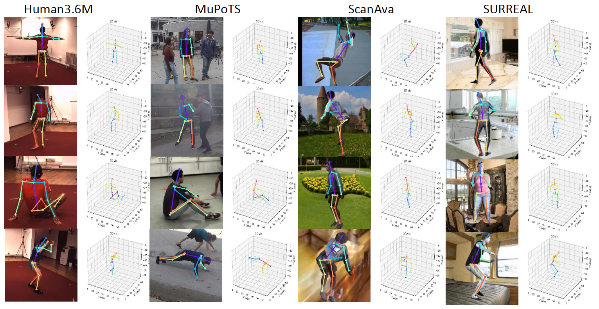

# Adapted Human Pose (AHuP): 3D Human Pose Estimation with Zero Real 3D Human Pose Data

## Intro:
AHuP aims at study the effect when a pretrained human pose estimation model is applied under a new environment and the corresponding adaptation approach.  Our working example is from Synthetic human to estimate real human which differes greatly in appearance and also hold "stiff" poses with over simplified skeleton.  Based on this without a single real 3D human data, we achieved comparable performance with the state-of-the-art model based on real human pose data on corresponding benchmarks.  

## Env Setup 
The required packages are provided in the requirementes.txt 
Here are some tips for installation. 

For cocoapi for windows: 
* install the [cocoapi](https://github.com/philferriere/cocoapi)
   this version supports windows. For linux, you can also use the offical release.    
install the cocoapi

`pip install git+https://github.com/philferriere/cocoapi.git#subdirectory=PythonAPI`

 If you don't want to install: just use 
`opts.cocoapi_dir`can be used to point to cocoapi directly 

This repo is developed with python 3.8, CUDA 10.2.  
 
* naming rules:  
SA ScanAva.  SR, SURREAL  
 
## Data Deployment

*`SURREAL`   data preparation scripts are provided in `dataPrep` folder. You need to get a user name and password from the SURREAL team first then use our script to generate SURREAL, please refer there readme inside. 

*`ScanAva`:  Additional collected scans, **RELEASE_UPON_ACCEPTANCE** 
  
* For `MSCOCO, MPII, Human3.6M, MuCo, MuPoTS`, please refer to [link](https://github.com/mks0601/3DMPPE_POSENET_RELEASE).  
Attention,  for MuPoTS and MuCo, we remove the middel subfolder `data` and put all contect directly under the dataset name folder.  
 
* setup the dataset dir with `opt.ds_dir`, all datasets should be located under this folder  with structure:    
```
${ds_dir}
|-- Human36M
|   |-- bbox_root
|   |-- bbox_root_human36m_output.json
|   |-- images
|   `-- annotations
|-- MPII
|   |-- images
|   `-- annotations
|-- MSCOCO
|-- |-- bbox_root
|   |   |-- bbox_root_coco_output.json
|   |-- images
|   |   |-- train/
|   |   |-- val/
|   `-- annotations
|-- MuCo
|  |-- augmented_set
|  |-- unaugmented_set
|  |-- MuCo-3DHP.json
|-- MuPoTS
|   `-- bbox_root
|   |   |-- bbox_mupots_output.json
|   |-- MultiPersonTestSet
|   `-- MuPoTS-3D.json
|-- ScanAva
|   |-- ScanName1
|   |   |-- images
|   |   `-- annotations.pkl
|   |   `-- ... 
| -- train_surreal_images 
|   |-- run0
|   |-- run1
|   |-- run2
|   `-- surreal_annotations_raw.npy
```

## Running AHuP demos
### Model deployment
All exps and models are saved in `output`. 
For `ScanAva` demo: 
 
* Semantic Aware Adaptation (SAA) 
`output/ScanAva-MSCOCO-MPII_res50_D0.02-l3k1-SA-psdt_lsgan_yl-y_regZ5_fG-n_lr0.001_exp/`

* Skeletal Pose Adaptation (SPA)
`output/GD_PA
`
### To Run  
to evaluate  `ScanAva-SAA-jt2d`:
`python test.py` 
 
After generate the result. Generate the `ScanAva-SAA-jt2d-SPA` result.    
`python train_PA_GD.npy --if_test_PA y` 

Run `SPA` evaluation: 
`python test.py --if_loadPreds y`    

to evaluate sota with SPA
evaluate with pretrained hg3d 
`source scripts/test_hg3d.sbatch <dsNm>`
then generate the SPA version  
`source scripts/test_PA_GD.sbatch <testSet>` 
get the SPA evaluation by loading in the SPA rst 
`source scripts/test_hg3d.sbatch <dsNm> y` 

Fort Other details, **RELEASE_UPON_ACCEPTANCE**

## vis  
single , save 2d+img and 3d separately 
multi, image + 3d skeleton 

## Reference
**RELEASE_UPON_ACCEPTANCE**

